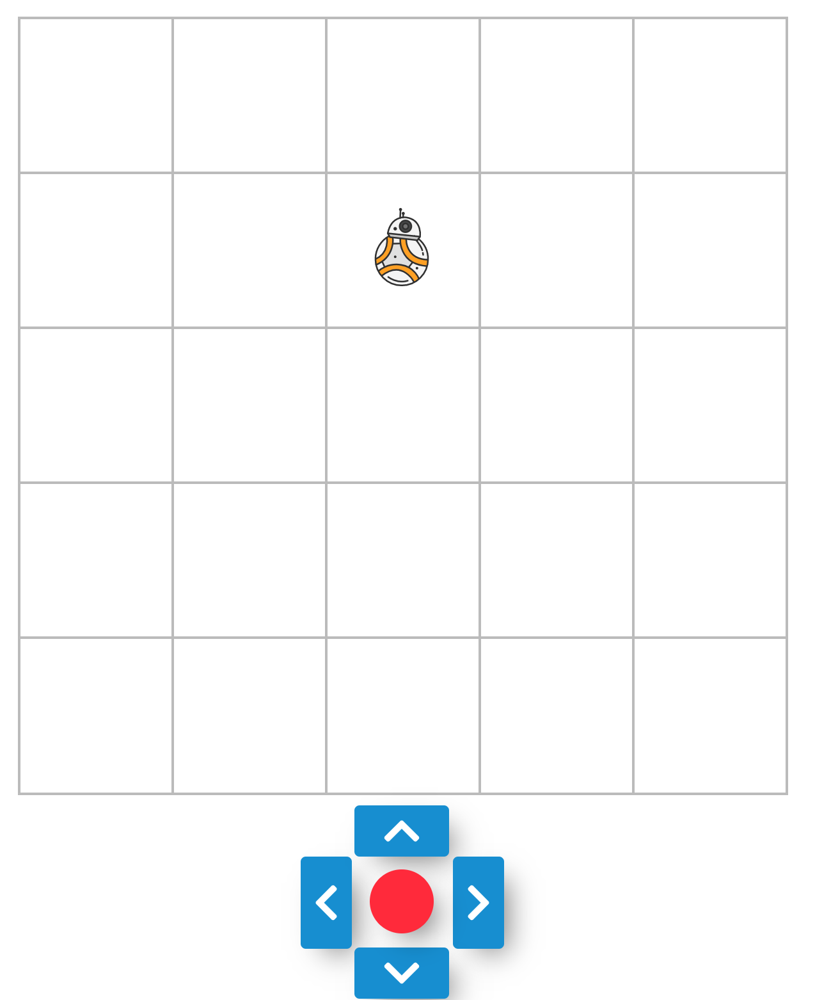

Simple React App for controlling a robot.

## Get Started

`$ git clone https://github.com/nataliesun/robot.git && cd robot`

`$ npm i`

`$ npm start`

## About

This project uses React Context, Node Sass (SCSS) and FontAwesome icons. 

